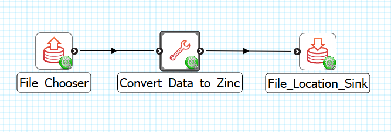

Convert Data to Zinc
====================

The **Convert Data to Zinc** is MAP Client plugin for converting data in a file into Zinc exf format.

Workflow Connections
--------------------

As shown in :numref:`fig-mcp-convert-data-to-zinc-workflow-connections`, the **Convert Data to Zinc** uses 1 input:

1. The input is the file that needs to be converted into a Zinc data file. It can be any type of data in the `Conversions`_ list. (Port: *https://opencmiss.org/1.0/rdf-schema#file_location*)

It produces 1 output which may be piped to other workflow steps:

1. A file with the data converted to a Zinc data supplied as a Zinc exf file. (Port: *https://opencmiss.org/1.0/rdf-schema#file_location*)

The **uses** port is the input data file.

.. _fig-mcp-convert-data-to-zinc-workflow-connections:

   **Convert Data to Zinc** workflow connections.

Configure
---------

The *Input data* parameter is the data type that needs to be converted to Zinc data. Each selection has a short description indicating the format of input data.

.. _fig-mcp-convert-data-to-zinc-configure-dialog:

.. figure:: _images/step-configuration-dialog.png
   :alt: Step configure dialog

   *Convert Data to Zinc* step configuration dialog, showing *ColonManometry* as the input data type.

.. _hdg-mcp-convert-data-to-zinc-ports:

Conversions
-----------

This plugin can be configured to convert the following types of data into exf format:

* Cell density data
* Colon high resolution manometry data
* Colon manometry data
* MBF Bioscience XML data
* Right Atrial Ganglionated Plexus (RAGP) neuron gene sampling data
* DXF data
* Object format data
* Polygon format data
* Stereolithography format data
* Scalar vector graphics (paths)
