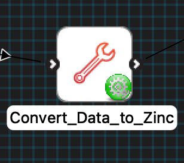
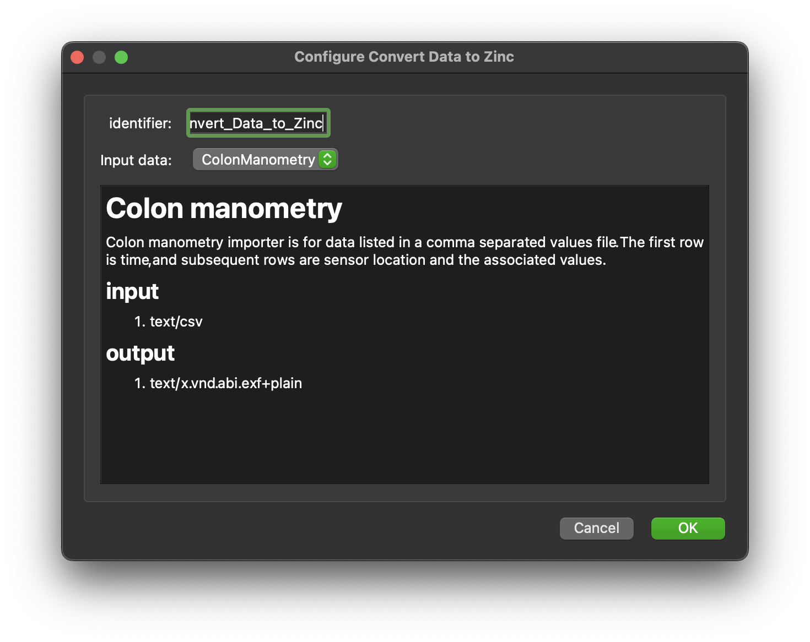

MAP Client Plugin - Convert Data to Zinc
========================================

The **Convert Data to Zinc** is MAP Client plugin for converting data in a file into Zinc exf format.

.. _fig-mcp-convert-data-to-zinc-configured-step:

   A configured *Merge Zinc Data* step icon.

**Table of contents**

* :ref:`hdg-mcp-convert-data-to-zinc-configure`
* :ref:`hdg-mcp-convert-data-to-zinc-ports`
* :ref:`hdg-mcp-convert-data-to-zinc-conversions`

.. _hdg-mcp-convert-data-to-zinc-configure:

Configure
---------

This step comes pre-configured.
The only configurable setting for this step is the step identifier.

.. _fig-mcp-convert-data-to-zinc-configure-dialog:

   *Merge Zinc Data* step configuration dialog.

.. _hdg-mcp-convert-data-to-zinc-ports:

Ports
-----

This plugin:

* **uses**:

  * *https://opencmiss.org/1.0/rdf-schema#file_location*

and

* **provides**:

  * *https://opencmiss.org/1.0/rdf-schema#file_location*

The **uses** port is the input data file.
The **provides** port is the data converted to a Zinc data supplied as a Zinc exf file.

.. _hdg-mcp-convert-data-to-zinc-conversion:

Conversions
-----------

This plugin can be configured to convert the following types of data into exf format:

* Colon high resolution manometry data
* Colon manometry data
* MBF Bioscience XML data
* Right Atrial Ganglionated Plexus (RAGP) neuron gene sampling data
* DXF data
* Object format data
* Polygon format data
* Stereolithography format data
* Scalar vector graphics (paths)
